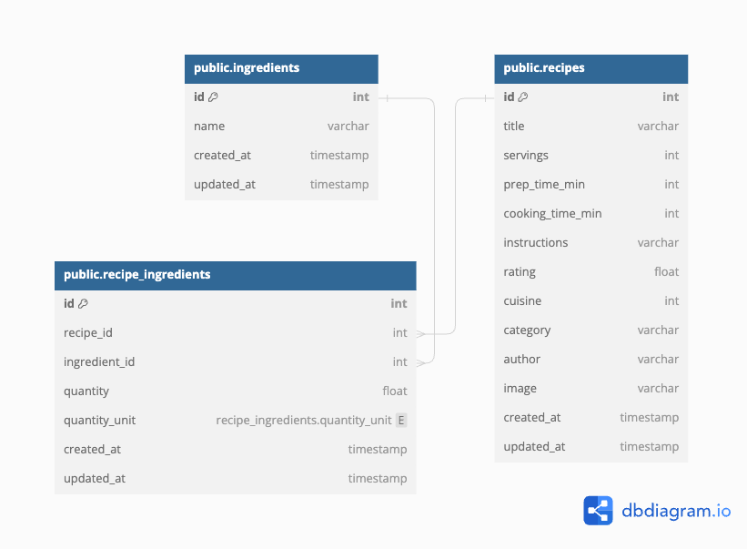

# Meal planner

## Overview

Meal planner is a Ruby on Rails application that helps users find the most relevant recipes they can prepare with the ingredients they have at home. The application allows users to filter recipes based on cook time, prep time, and rating.

## Features

- **Recipe Suggestions**: Suggests recipes based on available ingredients with optional filters for cook time, prep time, and rating.

## Technologies Used

- **Ruby**: 2.7
- **Rails**: 6.0
- **PostgreSQL**: 14.12

## User Stories

1. **As a user, I want to find recipes that I can make with the ingredients I have at home, so I can cook something without going shopping.**
2. **As a user, I want to filter recipes by cook time and prep time, so I can find recipes that fit my schedule.**
3. **As a user, I want to see the ratings of recipes, so I can choose the best recipes to try.**

## Database Structure

### Schema



## Getting Started

### Prerequisites

- Ruby 2.7 installed
- Rails 6.0 installed
- PostgreSQL database setup

### Installation

1. Clone the repository:

   ```bash
   git clone https://github.com/taniasoaressantos/mealplanner
   cd mealplanner
   ```

2. Install the required gems:

   ```bash
   bundle install
   ```

3. Setup the database:

   ```bash
   rails db:create
   rails db:migrate
   ```

### Running the Application

1. Start the Rails server:

   ```bash
   rails server
   ```

2. Open your web browser and navigate to `http://localhost:3000` to access the application.

### Importing Data

To backfill the database with recipes from a JSON file, use the following Rake task:

```bash
rake db:import_json
```

Ensure that the JSON file (`recipes-en.json`) is located in `db/seed_data/`.

## Application Structure

```
/project-root
|-- /app
|   |-- /controllers
|   |   |-- recipes_controller.rb
|   |-- /models
|   |   |-- ingredient.rb
|   |   |-- recipe.rb
|   |   |-- recipe_ingredient.rb
|   |-- /services
|   |   |-- data_fetcher.rb
|   |   |-- data_importer.rb
|   |   |-- ingredient_parser.rb
|   |   |-- recipe_creator.rb
|   |   |-- recipe_suggestion_service.rb
|-- /db
|   |-- /migrate
|   |-- /seed_data
|   |   |-- recipes-en.json
|-- /lib
|   |-- /tasks
|   |   |-- backfill_recipes.rake
|-- config.ru
|-- Gemfile
|-- Gemfile.lock
|-- README.md
```

## Key Components

### Models

- **Ingredient**: Manages ingredients and their associations with recipes.
- **Recipe**: Manages recipes and their attributes such as title, cook time, prep time, rating, and cuisine.
- **RecipeIngredient**: Manages the association between recipes and ingredients, including quantity and unit.

### Services

- **DataFetcher**: Handles the retrieval of data from various sources and formats.
- **DataImporter**: Manages the process of importing data from external sources, such as JSON files.
- **IngredientParser**: Parses ingredients from recipe data.
- **RecipeCreator**: Manages the creation of recipes and associated ingredients in the database.
- **RecipeSuggestionService**: Suggests recipes based on a list of ingredients and optional filters for cook time, prep time, and rating.

### Controllers

- **RecipesController**: Manages the API endpoints for listing, showing, and suggesting recipes.

### Rake Task

- **BackfillRecipes**: Imports recipes from a JSON file into the database.

## Testing

Ensure that your application is reliable and bug-free by running the tests:

```bash
rspec
```

## Future Improvements

- Enhance the extraction of quantities, units, and ingredients from the imported data to ensure better accuracy and consistency.
- Implement bulk import techniques to speed up the backfilling process and improve performance when importing large datasets.
- Optimize database queries for better performance.
- Add user authentication and user-specific recipe suggestions.
- Add more comprehensive test coverage.

## Contributing

1. Fork the repository.
2. Create a new branch (`git checkout -b feature-branch`).
3. Commit your changes (`git commit -am 'Add new feature'`).
4. Push to the branch (`git push origin feature-branch`).
5. Create a new Pull Request.

## License

This project is licensed under the MIT License.
